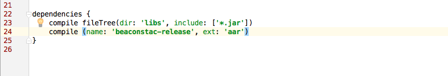
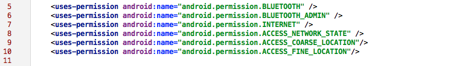
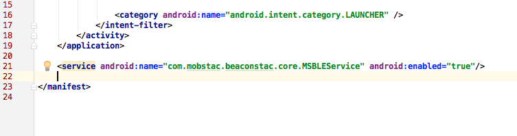
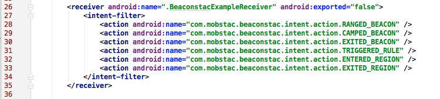
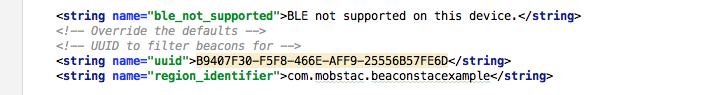
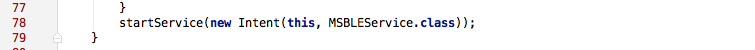

# Android-SDK

## Introduction

Beaconstac SDK is an easy way to enable proximity marketing and location analytics through an iBeacon-compliant BLE network. 

## Documentation

Please refer to the API documentation on the [Beaconstac developer hub](https://beaconstac.github.io/Android-SDK/).

## Integration with your existing project in Android Studio

1. Download or clone this repo on your system.
2. Copy the [beaconstac-release.aar](https://github.com/Beaconstac/Android-SDK/blob/master/BeaconstacSDK/beaconstac-release.aar) file into the `libs` directory of your app. Refer the included sample app for example.
3. In the `build.gradle` file of your project, add the following in the repositories section

        flatDir {
            dirs 'libs'
        }

4. In the `build.gradle` file of the app, add the following in the dependencies section:

        compile (name: 'beaconstac-release', ext: 'aar')

5. Refresh all Gradle projects.
6. Add the `BLUETOOTH` and `BLUETOOTH_ADMIN` permissions to app manifest:

        <uses-permission android:name="android.permission.BLUETOOTH" />
        <uses-permission android:name="android.permission.BLUETOOTH_ADMIN" />

7. Add the Beaconstac BLEService to your app manifest:

        <service android:name="com.mobstac.beaconstac.core.MSBLEService" android:enabled="true"/>

8. Should you choose to implement your own BroadcastReceiver (required if beacon detection has to work when the app is not running), extend `com.mobstac.beaconstac.core.BeaconstacReceiver` class and implement methods to handle the events `rangedBeacons`, `campedOnBeacon` and `exitedBeacon`. From the `BeaconstacExample` app:

        <receiver android:name=".BeaconstacExampleReceiver">
            <intent-filter>
                <action android:name="com.mobstac.beaconstac.intent.action.RANGED" />
                <action android:name="com.mobstac.beaconstac.intent.action.EXITED" />
                <action android:name="com.mobstac.beaconstac.intent.action.CAMPED" />
            </intent-filter>
        </receiver>

9. Add values for UUID, region_indentifier filter to `strings.xml`:

        <!-- Override the defaults -->
        <string name="filter_uuid"><!-- UUID to filter beacons by --></string>
        <string name="region_identifier"><!-- unique identifier for beacons --></string
        <!-- Optional: Override text message to be displayed when Bluetooth is disabled -->
        <string name="ble_disabled_text">Bluetooth is disabled. Beacon detection would not work.</string>

10. To start ranging beacons, call `startService` on `com.mobstac.beaconstac.core.MSBLEService` once the app starts.

        startService(new Intent(this, MSBLEService.class));

11. You can find more information and example usage in the `BeaconstacExample` app contained in the `examples` directory of this repo.
