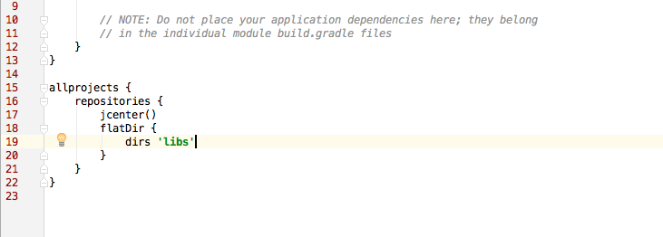

# Android-SDK

## Introduction

Beaconstac SDK is an easy way to enable proximity marketing and location analytics through an iBeacon-compliant BLE network.

## Documentation

Please refer to the API documentation on the [Beaconstac developer hub](https://beaconstac.github.io/Android-SDK/).

## Integration with your existing project in Android Studio

1. Download or clone this repo on your system.
2. Copy the [beaconstac-release.aar](https://github.com/Beaconstac/Android-SDK/blob/master/BeaconstacSDK/beaconstac-release.aar) file into the `libs` directory of your app. Refer the included sample app for example.
3. In the `build.gradle` file of your project, add the following in the repositories section

        flatDir {
            dirs 'libs'
        }

4. In the `build.gradle` file of the app, add the following in the dependencies section:

        compile (name: 'beaconstac-release', ext: 'aar')
        compile 'com.mcxiaoke.volley:library:1.0.17'
	    compile 'com.google.android.gms:play-services:8.1.0'
	    compile 'com.crittercism:crittercism-android-agent:5.0.6'
5. Refresh all Gradle projects.
6. Create a file `beaconstac.xml` in the `values` folder containing configurations for Beaconstac SDK. 

		<?xml version="1.0" encoding="utf-8"?>
        <resources>
            <!-- whether rule processing is enabled -->
            <bool name="ruleProcessingEnabled">true</bool>
            
            <!-- time interval in seconds between rule syncs -->
            <integer name="ruleSyncInterval">86400</integer>
            
            <!-- events for which rules would be processed -->
            <string-array name="ruleEvents">
                <item>CAMPED</item>
                <item>EXITED</item>
            </string-array>

            <!-- whether analytics is enabled -->
            <bool name="analyticsEnabled">true</bool>
            
            <!-- time interval in seconds between analytics posting -->
            <integer name="analyticsPostInterval">900</integer>
            
            <!-- Whether bug tracking is enabled -->
		    <bool name="bugTrackingEnabled">true</bool>

            <!-- Beaconstac API token -->
            <string name="api_key"></string>
            
            <!-- Organization id -->
            <integer name="organization_id">0</integer>
            
            <!-- Provider authority -->
		    <string name="provider">com.mobstac.beaconstacexample.provider</string>
        </resources>

    		Please do ensure that the organization_id and the api_key have been filled into the beaconstac.xml.
    		This can be found under account details on the manage.beaconstac.com portal.
    		If this is not set, the rules will not get triggered.

7. Add `uses-feature` tag to app manifest:

		<uses-feature
        android:name="android.hardware.bluetooth_le"
        android:required="false" />
8. Add the following permissions to app manifest:

        <uses-permission android:name="android.permission.BLUETOOTH" />
        <uses-permission android:name="android.permission.BLUETOOTH_ADMIN" />
        <uses-permission android:name="android.permission.INTERNET" />
        <uses-permission android:name="android.permission.ACCESS_NETWORK_STATE" />
        <uses-permission android:name="android.permission.ACCESS_COARSE_LOCATION"/>
        <uses-permission android:name="android.permission.ACCESS_FINE_LOCATION"/>
9. Add the Beaconstac BLEService to your app manifest:

        <service android:name="com.mobstac.beaconstac.core.MSBLEService" android:enabled="true"/>        
10. Should you choose to implement your own BroadcastReceiver (required if beacon detection has to work when the app is not running), extend `com.mobstac.beaconstac.core.BeaconstacReceiver` class and implement methods to handle the `rangedBeacons`, `campedOnBeacon`, `exitedBeacon`, `triggeredRule`, `enteredRegion` and `exitedRegion` events. The `BeaconstacExample` app contains an example of each type - directly using `BeaconstacReceiver` in the activity (this will require registering and unregistering it to receive intents in the activity itself), and extending `BeaconstacReceiver` and registering it to receive `actions` declared in the app manifest.
11. Add the Beaconstac-provided actions in the app manifest that you wish to listen for, in your BroadcastReceiver. From the `BeaconstacExample` app manifest:

        <receiver android:name=".BeaconstacExampleReceiver" android:exported="false">
            <intent-filter>
                <action android:name="com.mobstac.beaconstac.intent.action.RANGED_BEACON" />
                <action android:name="com.mobstac.beaconstac.intent.action.CAMPED_BEACON" />
                <action android:name="com.mobstac.beaconstac.intent.action.EXITED_BEACON" />
                <action android:name="com.mobstac.beaconstac.intent.action.TRIGGERED_RULE" />
                <action android:name="com.mobstac.beaconstac.intent.action.ENTERED_REGION" />
                <action android:name="com.mobstac.beaconstac.intent.action.EXITED_REGION" />
                <action android:name="com.mobstac.beaconstac.intent.action.ENTERED_GEOFENCE" />
                <action android:name="com.mobstac.beaconstac.intent.action.EXITED_GEOFENCE" />
            </intent-filter>
        </receiver>
12. Add `provider` to the manifest. Please implement your own ContentProvider that extends `com.mobstac.beaconstac.provider.MSContentProvider`. From the `BeaconstacExample` app:

		<provider
            android:name=".MyContentProvider"
            android:authorities="@string/provider"
            android:enabled="true"
            android:exported="false"
            android:multiprocess="true"
            android:grantUriPermissions="true"
            android:syncable="true" >
13. To monitor beacon regions, configure the `UUID` and `region_identifier`.

        // set region parameters (UUID and unique region identifier)
        Beaconstac bstacInstance = Beaconstac.getInstance(this);
        bstacInstance.setRegionParams("F94DBB23-2266-7822-3782-57BEAC0952AC",
                "com.mobstac.beaconstacexample");
14. Call `startRangingBeacons` on the `Beaconstac` instance after configuring the params as mentioned in the previous step. The method will throw `MSException` on devices running Androi 17 or below.

        // start scanning
        bstacInstance.startRangingBeacons();
15. If you want to stop scanning for beacons, call `stopRangingBeacons` on the `Beaconstac` instance. The method will throw `MSException` on devices running Androi 17 or below.

        // stop scanning
        bstacInstance.stopRangingBeacons();
16. You can also dynamically set `organization_id` and `api_key` using `setOrgId` and `setDevToken` methods on the `Beaconstac` instance.
17. Add `MSGeofenceTransitionIntentService` to manifest if you want to use the SDK's Geofence APIs.

		<service android:name="com.mobstac.beaconstac.core.MSGeofenceTransitionIntentService" />
18. Implement the `PlaceSyncReceiver` before calling `enableGeofences` on the `Beaconstac` instance.

You can find more information and example usage in the `BeaconstacExample` app contained in the `examples` directory of this repo.
